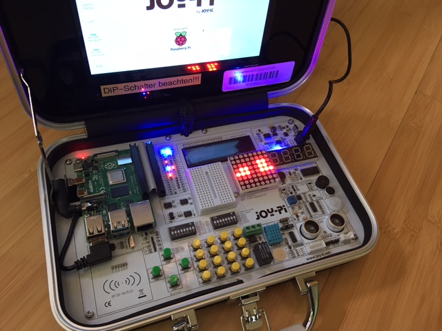

# Demo project using MQTT on the Joy-Pi

## Description

This demo project consists of the following components:

1. A MQTT producer sending temperature and humidity
1. A Streamsheets app calculating the trend
1. A MQTT consumer drawing the trends on the 8×8 pixel display as bars

Used hardware: [Joy-Pi experimental case](https://joy-it.net/en/products/RB-JoyPi)

The sensor is the blue part in the lower part.

## Installation

1. Install [Streamsheets](https://projects.eclipse.org/projects/iot.streamsheets). It runs the MQTT broker. I've installed it on a virtual machine running Debian.
1. Install the necessary libraries to run the DHT11 sensor and the LED matrix as written in the [manual](https://joy-pi.net/wp-content/uploads/2020/09/RB-JoyPi-Manual-29-09-2020-1.pdf) ([German version](https://joy-pi.net/wp-content/uploads/2020/09/RB-JoyPi-Anleitung-29-09-2020-1.pdf)).
1. Install Paho MQTT on the Raspberry Pi.

## Preparation of Streamsheets

1. Start Streamsheets by executing `./start.sh`.
1. Open Streamsheets in the browser on http://_ip address_:8081
1. Login using your credentials.
1. Import the [Streamsheets app](Demo_with_Raspberry.streamsheets.json) .
1. Create the necessary MQTT connector and streams. It uses the local MQTT broker, which is already created by the installation. The topic of the connector is _tutorial/_. The topic of the consumer stream is _joy1_.  

1. Run the app by pressing the start button on the sheet.

## Preparation on Raspberry Pi

1. Set the following environment variables **MQTT_SERVER**, **MQTT_USERNAME** (most probably *streamsheets*) and **MQTT_PASSWORD** (see the password on the connector settings).
1. Run `./send_mqtt.py` in one terminal.
1. Run `./receive_mqtt.py` in the other terminal.
1. Enjoy it!

## Streamsheet projects in this repository

### Display of the trend of temperature and humidity 

This is the project described above. It was created for a demo at the [University of Applied Sciences Burgenland](https://www.fh-burgenland.at).

- Used scripts on Raspberry Pi: [send_mqtt.py](./send_mqtt.py), [receive_mqtt.py](./receive_mqtt.py)
- Used Streamsheets file: [Demo_with_Raspberry.streamsheets.json](Demo_with_Raspberry.streamsheets.json)
- Demo video (in German language): https://www.youtube.com/watch?v=MzzdVWa0WoU

### Calculation of the dew point

A project calculating the dew point using temperature and humidity, extended with an alarm, if the spread is too low.

This project was build for a presentation at the local Linux event called [Linuxwochen Eisenstadt](http://www.linuxwochen.at/linuxwochen-eisenstadt-summary).

- Used scripts on Raspberry Pi: [send_mqtt.py](./send_mqtt.py), [alarm.py](./alarm.py)
- Used Streamsheets file: [Dew_point_calculation.streamsheets.json](Dew_point_calculation.streamsheets.json)
- [Presentation (in German language)](img/Streamsheets%20Linuxwochen%202021.pdf)
- [Video (sorry for the wrong colors)](https://www.linuxwochen.at/download/20210424_1500_franz_knipp.webm)
